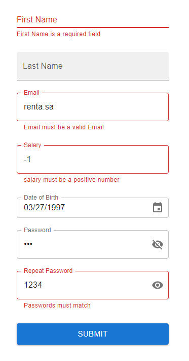

# @mrii/react-form-builder

library to easily build forms using react-hook-form, MUI & yup.

compatible with Next Js (for )

## Install

```sh
yarn add @mrii/react-form-builder

# or using npm

npm i @mrii/react-form-builder
```

## Basic Examples

### _Very simple form_:

```tsx
import { useCallback } from 'react';
import { FormBuilder, FormSubmitInput, TextInput } from '@mrii/react-form-builder';
import { Box } from '@mui/material';

const Form = () => {
  const onSubmit = useCallback(async values => {
    await new Promise(res => {
      setTimeout(res, 2000);
    });
    console.log({ values });
  }, []);

  return (
    <Box sx={{ display: 'flex', flexDirection: 'column', maxWidth: 300, mx: 'auto' }}>
      <FormBuilder onSubmit={onSubmit} useFormProps={{ defaultValues: { title: '' } }}>
        <TextInput name='title' label='Title' />
        <FormSubmitInput size='large' variant='contained' sx={{ mt: 2 }}>
          Submit
        </FormSubmitInput>
      </FormBuilder>
    </Box>
  );
};
```

or using typescript

```tsx
import { useCallback } from 'react';
import { FormBuilder, FormSubmitInput, TextInput } from '@mrii/react-form-builder';
import { Box } from '@mui/material';
import { SubmitHandler } from 'react-hook-form';

type FormFields = {
  title: string;
};

const Form: React.VFC = () => {
  const onSubmit = useCallback<SubmitHandler<FormFields>>(async values => {
    await new Promise(res => {
      setTimeout(res, 2000);
    });
    console.log({ values });
  }, []);

  return (
    <Box sx={{ display: 'flex', flexDirection: 'column', maxWidth: 300, mx: 'auto' }}>
      <FormBuilder<FormFields>
        onSubmit={onSubmit}
        useFormProps={{ defaultValues: { title: '' } }}
      >
        <TextInput name='title' label='Title' />
        <FormSubmitInput size='large' variant='contained' sx={{ mt: 2 }}>
          Submit
        </FormSubmitInput>
      </FormBuilder>
    </Box>
  );
};
```

the result:


once you click submit the button will be in loading state while the `onSubmit` promise in pending:


### _Basic form_:

```tsx
import { useCallback } from 'react';
import {
  DateInput,
  FormBuilder,
  FormSubmitInput,
  NumberInput,
  PasswordInput,
  TextInput,
} from '@mrii/react-form-builder';
import { Box } from '@mui/material';
import { SubmitHandler } from 'react-hook-form';
import { date, number, object, ref, SchemaOf, string } from 'yup';
import { LocalizationProvider } from '@mui/lab';
import AdapterDateFns from '@mui/lab/AdapterDateFns';

type FormFields = {
  firstName: string;
  lastName?: string;
  email: string;
  salary: number;
  dateOfBirth: Date;
  password: string;
  repeatPassword: string;
};

const schema: SchemaOf<FormFields> = object({
  firstName: string().required(),
  lastName: string().optional(),
  email: string().email().required(),
  salary: number().positive().required(),
  dateOfBirth: date().max(new Date()).required(),
  password: string().required(),
  repeatPassword: string()
    .equals([ref('password')], 'Passwords must match')
    .required(),
});

const defaultValues: FormFields = {
  firstName: '',
  lastName: '',
  email: '',
  salary: 0,
  dateOfBirth: new Date(),
  password: '',
  repeatPassword: '',
};

const Form: React.VFC = () => {
  const onSubmit = useCallback<SubmitHandler<FormFields>>(async values => {
    await new Promise(res => {
      setTimeout(res, 2000);
    });
    console.log({ values });
  }, []);

  return (
    <LocalizationProvider dateAdapter={AdapterDateFns}>
      <Box sx={{ display: 'flex', flexDirection: 'column', maxWidth: 300, mx: 'auto' }}>
        <FormBuilder<FormFields>
          validation={schema}
          onSubmit={onSubmit}
          useFormProps={{
            defaultValues,
          }}
        >
          <TextInput
            name='firstName'
            label='First Name'
            variant='standard'
            margin='normal'
          />
          <TextInput name='lastName' label='Last Name' variant='filled' margin='normal' />
          <TextInput name='email' label='Email' variant='outlined' margin='normal' />
          <NumberInput name='salary' label='Salary' variant='outlined' margin='normal' />
          <DateInput
            name='dateOfBirth'
            label='Date of Birth'
            loadingTextFieldProps={{
              size: 'small',
              margin: 'normal',
            }}
          />
          <PasswordInput
            name='password'
            label='Password'
            variant='outlined'
            margin='normal'
          />
          <PasswordInput
            name='repeatPassword'
            label='Repeat Password'
            variant='outlined'
            margin='normal'
          />

          <FormSubmitInput size='large' variant='contained' sx={{ mt: 2 }}>
            Submit
          </FormSubmitInput>
        </FormBuilder>
      </Box>
    </LocalizationProvider>
  );
};
```

the result:


